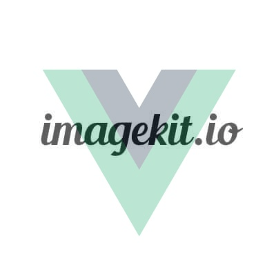

<div align="center">
  
  <h1>Vue Image Kit</h1>
</div>
<p align="center">
  Vue.js Image Kit Component with Lazy Load built in and Responsive Images
</p>
<p align="center">
  The inspiration comes from <a href="https://codesandbox.io/s/vue-lazy-load-image-ls9rh?fontsize=14&hidenavigation=1&module=%2Fsrc%2FApp.vue&theme=dark" target="_blank">this</a> and a talk from <a href="https://github.com/derevandal" target="_blank">@derevandal</a> in <a href="https://github.com/femug" target="_blank">@femug</a>
</p>

<p align="center">
    <a href="https://circleci.com/gh/guastallaigor/vue-image-kit/tree/master"></a>
    <a href="https://codecov.io/gh/guastallaigor/vue-image-kit"></a>
    <a href="https://www.npmjs.com/package/vue-image-kit"></a>
    <a href="https://github.com/guastallaigor/vue-image-kit/releases"></a>
    <a href="http://standardjs.com"></a>
    <a href="https://app.netlify.com/sites/vue-image-kit/deploys"></a>
</p>

> **Note:**
> This is an unofficial project.
> I do not work or am I affiliated with Image Kit

## Demo

[](https://codesandbox.io/s/vue-image-kit-keeh1)

## Storybook

Go to https://vue-image-kit.netlify.com

## How does it work

This component uses the [Image Kit Real-time URL-based image transformation](https://imagekit.io/features/image-resize-smart-crop-responsive-dpr-client-hints), so you will need to have your images over [Image Kit](https://imagekit.io/) for it to work

For more informations about [Image Kit](https://imagekit.io/), consult their website

## How to install

### npm

```bash
$ npm install vue-image-kit --save
```

### yarn (recommended)

```bash
$ yarn add vue-image-kit
```

## Quick start
### Vue.js

You can import in your `main.js` file

```js
import Vue from 'vue'
import VueImageKit from 'vue-image-kit'

Vue.use(VueImageKit)
```

Or locally in any component

```js
import { VueImageKit } from 'vue-image-kit'

export default {
  components: {
    VueImageKit
  }
}
```

### Nuxt.js

You can import as a Nuxt.js plugin

`~/plugins/vue-image-kit.js`
```js
import Vue from 'vue'
import VueImageKit from 'vue-image-kit'

Vue.use(VueImageKit)
```

and then import it in your `nuxt.config.js` file
```js
plugins: [
  { src: '~/plugins/vue-image-kit', mode: 'client' }
]
```

## Basic usage

```html
<template>
  <vue-image-kit
    hash="6xhf1gnexgdgk"
    src="lion_BllLvaqVn.jpg"
    :width="1400"
    :height="800"
    alt="Lion image"
  />
</template>
```

## Props

| Property name   | Type   | Default         | Required | Description                                                                         |
|-----------------|--------|-----------------|----------|-------------------------------------------------------------------------------------|
| hash            | String | null            | true     | Images hash. Example: Take this image -> https://ik.imagekit.io/6xhf1gnexgdgk/lion_BllLvaqVn.jpg, the hash is '6xhf1gnexgdgk' |
| src             | String | null            | true     | Images source. Example: Take this image -> https://ik.imagekit.io/6xhf1gnexgdgk/lion_BllLvaqVn.jpg, the source is 'lion_BllLvaqVn.jpg' |
| placeholder     | String | ''              | false    | Images placeholder. Here you can pass a link |
| backgroundColor | String | ''              | false    | Background color of the images placeholder |
| srcset          | Array  | [320, 480, 800] | false    | Array of numbers that will define the images srcset attribute. Each number correspond to one of the images width |
| sizes           | Array  | []              | false    | Array of numbers that will define the images sizes attribute. Each number correspond to one of the images max-width. Empty by default, which gets each of the images srcset prop and subtract by 40px |
| defaultSize     | Number | 1080            | true     | Images default size. Must be larger than the largest srcset and sizes |
| customTransform | String | ''              | false    | Use this to append any extra image kit transform that you want |
| width           | Number | null            | false    | Images width. Width number in pixels. It will be set with inline style |
| height          | Number | null            | false    | Images height. Height number in pixels. It will be set with inline style |
| alt             | String | ''              | false    | Images alt attribute |

## Development

[](https://github.com/guastallaigor/vue-image-kit/issues)

Fork the project and enter this commands in your terminal

```sh
git clone https://github.com/YOUR_GITHUB_USERNAME/vue-image-kit.git
cd vue-image-kit
yarn
```

### Storybook
For visual testing, this project contains storybook which you can run by doing the next command
```sh
$ yarn storybook
```

### Jest
Before making the PR, if you changed something that needs to be tested, please make the tests inside the `tests/unit` folder.

To run the tests, you can use the next command

```sh
$ yarn test:unit
```

### Commitlint
This project follows the [commitlint](https://github.com/conventional-changelog/commitlint) guidelines, with minor changes.

You can commit using `npm run commit` to help you with that.

There's a `pre-push` hook that runs all the unit tests before you can push it.

If an error occurs, you can use the `npm run commit:retry` command that runs the previous `npm run commit` that you already filled.

<a href="https://www.buymeacoffee.com/guastallaigor" target="_blank"></a>

## License

MIT © [guastallaigor](https://github.com/guastallaigor/vue-image-kit/blob/master/LICENSE)
